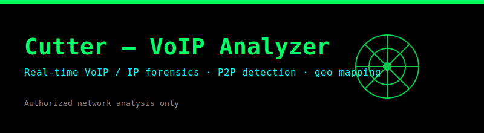

# Cutter — VoIP Analyzer



> Real-time WhatsApp VoIP traffic analyzer with GUI, P2P peer detection, and geolocation mapping.

**Cutter** is a forensic-grade network analysis tool that captures, classifies, and visualizes WhatsApp VoIP traffic on your local network. Built for authorized security researchers, network administrators, and digital forensics professionals.

---

## Features

- **Live Packet Capture** — Real-time sniffing of WhatsApp VoIP traffic using Npcap/WinPcap
- **P2P Peer Detection** — Automatically identifies peer-to-peer call participants via STUN, DTLS, and SRTP analysis
- **IP Intelligence** — Geolocates IPs via ip-api.com with LRU caching and rate limiting
- **Interactive Map** — Visualizes call routes on a Folium-powered map (embedded in the UI)
- **Multi-Protocol** — Detects WhatsApp, Signal, Telegram, and Google Meet traffic
- **Session Recording** — Logs all sessions to SQLite with CSV/JSON/HTML export
- **Dark & Light Themes** — Switchable UI themes
- **Standalone EXE** — No Python installation required (Windows)

---

## Download

Grab the latest installer from the [Releases page](https://github.com/simpletarun/voip-analyzer/releases).

| File | Description |
|------|-------------|
| `CutterSetup-Windows-v3.1.0.exe` | Windows installer (Npcap bundled, 204 MB) |
| `Source code (zip)` | Python source code for manual setup |

---

## Installation

### Windows (Installer — Recommended)

1. Download `CutterSetup-Windows-v3.1.0.exe` from [Releases](https://github.com/simpletarun/voip-analyzer/releases)
2. Run the installer (admin rights required)
3. Npcap (packet capture driver) is installed automatically if not present
4. Launch **Cutter** from the Start Menu or Desktop shortcut

**Requirements:**
- Windows 10/11 (64-bit)
- Administrator privileges for packet capture
- Network adapter with promiscuous mode support

### From Source (Python)

**Prerequisites:**
- Python 3.10+
- [Npcap](https://npcap.com) installed (WinPcap alternative)

```bash
git clone https://github.com/simpletarun/voip-analyzer.git
cd voip-analyzer
pip install .
python -m src.main
```

> **Note:** Run as Administrator on Windows for packet capture access.

---

## Configuration

All settings live in `config/config.json` and can be overridden via a `.env`
file (copy `.env.example` → `.env`). No secrets are stored in code.

| Setting | Default | Purpose |
|---------|---------|---------|
| `api_timeout` | 5 | Per-request timeout for ip-api |
| `cache_ttl_hours` | 24 | IP cache lifetime |
| `max_api_calls_per_min` | 40 | API rate limit |
| `theme` | dark | UI theme |
| `data_retention_days` | 90 | Auto-purge old sessions |
| `whatsapp_ports` | ranges | BPF capture filter |

## Enrichment Plugins

Optional third-party intelligence is loaded from `src/enrichment/` when the
corresponding API key is present in `.env`:

| Plugin | Env var | Adds |
|--------|---------|------|
| VirusTotal | `VIRUSTOTAL_API_KEY` | malicious/suspicious votes |
| AbuseIPDB | `ABUSEIPDB_API_KEY` | abuse confidence + reports |
| Shodan | `SHODAN_API_KEY` | open ports, org, OS |
| IPQualityScore | `IPQS_API_KEY` | VPN/Proxy/Tor + fraud score |

Lookups run **concurrently** and feed the abuse/fraud/VPN/Tor scoring.

## Export Formats

CSV, JSON, HTML, **Markdown**, **Excel** and **PDF** — all timestamped and
available from *File → Export Report*.

---

## Usage

### First Launch

1. Accept the legal disclaimer
2. Select your network interface from the dropdown
3. Click **Start Capture**

### Interface Overview

| Section | Description |
|---------|-------------|
| **Packet Table** | Real-time list of captured VoIP packets (source, dest, protocol, port, etc.) |
| **P2P Peers** | Detected peer-to-peer call participants with confidence scores |
| **IP Details** | Geolocation, ISP, and organization data for each IP |
| **Map** | Geographic visualization of call routes |
| **Status Bar** | Packet count, capture rate, and application status |

### Controls

- **Start/Stop Capture** — Begin or pause packet sniffing
- **Clear** — Clear current packet buffer
- **Export** — Export session data as CSV, JSON, or HTML report
- **Filter** — Filter by IP, port, or protocol
- **Theme Toggle** — Switch between dark and light mode

### Export Formats

| Format | Contents |
|--------|----------|
| **CSV** | Tabular packet data for spreadsheet analysis |
| **JSON** | Machine-readable structured data |
| **HTML** | Interactive report with embedded map |

---

## Legal Notice

> **FOR AUTHORIZED USE ONLY**
>
> This tool is strictly for educational purposes and authorized network analysis. Intercepting, monitoring, or analyzing communications without explicit consent from all parties is illegal in many jurisdictions.
>
> By using this software, you confirm:
> - You have the legal right to monitor the target network
> - You comply with all applicable local, state, and federal laws
> - All captured data is stored locally on your device
> - The developers assume no liability for misuse
>
> **Privacy:** No phone numbers or message content are transmitted. Only public IP metadata is queried from ip-api.com.

---

## Project Structure

```
voip-analyzer/
├── src/                  # Application source
│   ├── app.py            # Entry point & setup
│   ├── config.py         # Configuration management
│   ├── database/         # SQLite storage layer (migrations + repositories)
│   ├── export/           # CSV/JSON/HTML/Markdown/Excel/PDF exporters
│   ├── models/           # Data models (Packet, Session, IPInfo)
│   ├── plugins/          # VoIP protocol classifiers (WhatsApp, Signal, etc.)
│   ├── enrichment/       # Third-party IP intel plugins (VirusTotal, etc.)
│   ├── services/         # Capturer, IP intel, network analyzer
│   ├── ui/               # PyQt6 GUI (main window, dialogs, theme)
│   └── utils/            # Validation, errors, concurrency helpers
├── tests/                # Test suite (pytest)
├── docs/                 # Architecture, plugin & DB documentation
├── config/               # Default configuration
├── installer.iss         # Inno Setup script for EXE packaging
├── pyproject.toml        # Python project metadata
└── README.md
```

---

## Development

```bash
# Install dev dependencies
pip install -e ".[dev]"

# Run tests
pytest

# Build standalone EXE
pip install pyinstaller
python -m PyInstaller cutter.py --onedir --windowed --name cutter --add-data "config/config.json;config" --paths . --exclude PyQt5 --exclude PySide6

# Build installer (requires Inno Setup)
iscc installer.iss
```

---

## License

MIT License — see [LICENSE](LICENSE) for details.
