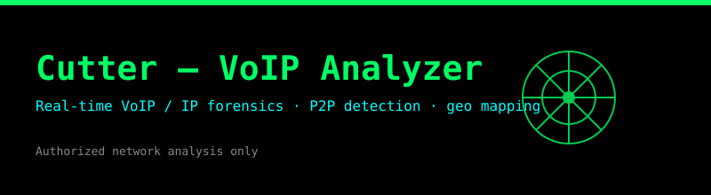

# Cutter — VoIP Analyzer

<p align="center">
  
</p>

<p align="center">
  <a href="https://github.com/simpletarun/voip-analyzer/releases"></a>
  
  
  
</p>

> Real-time traffic analyzer with GUI, P2P peer detection, rich IP intelligence, and interactive geolocation mapping.

**Cutter** is a network analysis tool that captures and visualizes VoIP traffic on your local network.

---

## Demo


*Live packet capture, P2P peer detection, and the analyzer UI in action.*

---

## Table of Contents

- [Features](#features)
- [Download](#download)
- [Installation](#installation)
- [Quick Start](#quick-start)
- [Project Structure](#project-structure)
- [Development](#development)
- [Legal Notice](#legal-notice)
- [License](#license)

---

## Features

- **Live Packet Capture** — Real-time sniffing of VoIP traffic using Npcap (Windows) / libpcap (Linux).
- **P2P Peer Detection** — Automatically identifies peer-to-peer call participants via STUN, DTLS, and SRTP analysis.
- **Geolocation** — Geolocates IPs via ip-api.com with dual HTTP/HTTPS fallback, LRU caching, and rate limiting. Your own location is detected to city / state / country and pinned correctly on the map.
- **Interactive Map** — Folium-powered map embedded in the UI with **4 basemap modes** (Dark, Satellite, Street, Light), a full-screen view with an Exit button, and a route/peer overlay.
- **Rich IP Metadata** — ISP, ASN, organization, region, country, postal code, timezone, and currency shown in a detailed inspector.
- **Multi-Protocol** — Detects WhatsApp, Signal, Telegram, and Google Meet traffic.
- **Session Recording** — Logs every session to SQLite with CSV / JSON / HTML / Markdown / Excel / PDF export.
- **Dark & Light Themes** — Switchable UI themes.
- **Standalone Build** — Self-contained Windows installer; no Python install required.

---

## Download

Grab the latest build from the [Releases page](https://github.com/simpletarun/voip-analyzer/releases).

| File | Platform | Description |
|------|----------|-------------|
| `CutterSetup-v3.2.0.exe` | Windows | Self-contained installer (Npcap bundled, ~166 MB) |
| `Source code (zip)` | Any | Full Python source for manual setup |
| `Source code (tar.gz)` | Linux / macOS | Full Python source for manual setup |

---

## Installation

### Windows (Installer — Recommended)

1. Download `CutterSetup-v3.2.0.exe` from [Releases](https://github.com/simpletarun/voip-analyzer/releases).
2. Run the installer (administrator rights required).
3. Npcap (the packet-capture driver) is installed automatically if not present.
4. Launch **Cutter** from the Start Menu or Desktop shortcut.

**Requirements:**
- Windows 10 / 11 (64-bit)
- Administrator privileges for live packet capture
- A network adapter that supports promiscuous mode

### From Source (Windows / Linux / macOS)

**Prerequisites:**
- Python 3.10 or newer
- [Npcap](https://npcap.com) on Windows (libpcap on Linux/macOS)

```bash
git clone https://github.com/simpletarun/voip-analyzer.git
cd voip-analyzer
python -m venv venv
source venv/bin/activate        # Windows: venv\Scripts\activate
pip install -r requirements.txt
python -m src.main
```

> **Note:** On Linux/macOS, run with `sudo python -m src.app` for live capture access.

---

## Quick Start

1. Launch **Cutter** (installer shortcut, or `python -m src.app` from source).
2. Select your network interface from the dropdown.
3. Click **Start Capture** to begin sniffing VoIP traffic.
4. Inspect packets, P2P peers, and IP intelligence in real time.
5. Open the **Map** tab to visualize call routes; switch basemaps or go full-screen.
6. Export a report from **File → Export Report**.

---

## Project Structure

```
voip-analyzer/
├── src/                     # Application source
│   ├── app.py               # Application entry point (run())
│   ├── main.py              # Console-script entry point
│   ├── composition.py       # Dependency wiring
│   ├── config.py            # Configuration management
│   ├── database/            # SQLite storage layer (connections + repositories)
│   ├── export/              # CSV/JSON/HTML/Markdown/Excel/PDF exporters
│   ├── models/              # Data models (Packet, Session, IPInfo)
│   ├── plugins/             # VoIP protocol classifiers (WhatsApp, Signal, etc.)
│   ├── enrichment/          # Third-party IP-intel plugins (VirusTotal, etc.)
│   ├── services/            # Capturer, IP intel, network analyzer
│   ├── ui/                  # PyQt6 GUI (main window, dialogs, theme, widgets)
│   └── utils/               # Validation, errors, concurrency helpers
├── tests/                   # Test suite (pytest)
├── docs/                    # Architecture, plugin & DB documentation
├── config/                  # Default configuration
├── assets/                  # Banner, demo GIF, and UI assets
├── cutter.spec              # PyInstaller spec for the standalone build
├── installer.iss            # Inno Setup script for the Windows installer
├── pyproject.toml          # Python project metadata
└── README.md
```

---

## Development

```bash
# Create a virtual environment and install dev dependencies
python -m venv venv
source venv/bin/activate        # Windows: venv\Scripts\activate
pip install -e ".[dev]"

# Run the test suite
pytest

# Build the standalone executable (PyInstaller)
pyinstaller cutter.spec

# Build the Windows installer (requires Inno Setup)
iscc installer.iss
```

> The standalone build is produced from `cutter.spec`, which bundles the Qt6
> WebEngine runtime required for the interactive map.

## License

MIT License — see [LICENSE](LICENSE) for details.
